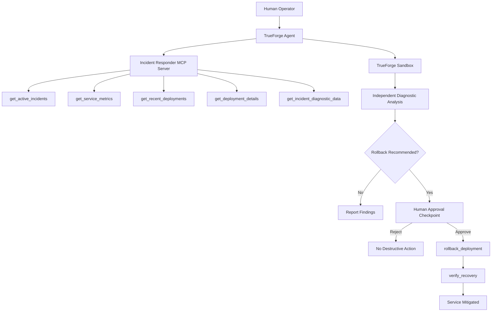

# Architecture — AI Production Incident Responder

## Overview

The AI Production Incident Responder uses TrueForge as the agent harness and a custom Model Context Protocol (MCP) server as the production-tool interface.

The system separates investigation, diagnostic computation, human decision-making, remediation, and recovery verification.

## Architecture



## Investigation Boundary

Investigation MCP tools are read-only.

They provide:

- active incident information,
- pre-incident and incident metrics,
- deployment history,
- deployment configuration changes,
- diagnostic evidence for sandbox analysis.

`POST_ROLLBACK` metrics are intentionally hidden from investigation tools so that future recovery evidence cannot influence the root-cause decision.

## Sandbox Boundary

TrueForge executes diagnostic code in an isolated sandbox.

The sandbox independently calculates:

- error-rate increase,
- relative error-rate increase,
- database timeout reduction,
- closest deployment,
- deployment-to-incident time difference.

This separates deterministic computation from free-form model reasoning.

## Human Safety Boundary

`rollback_deployment` is explicitly destructive:

```text
readOnlyHint: false
destructiveHint: true
```

The agent must obtain explicit human approval before invoking it.

If approval is rejected, no rollback should occur.

## Recovery Boundary

The agent does not infer recovery from a successful rollback.

It must call:

```text
verify_recovery
```

The tool first confirms that the implicated deployment has status:

```text
ROLLED_BACK
```

Only then can it consume the deterministic `POST_ROLLBACK` metric.

## Incident Lifecycle

Service recovery and incident resolution are intentionally separate states.

```text
Service recovered
      ↓
MITIGATED

Incident record
      ↓
OPEN
```

A recovered service does not automatically cause the incident record to be marked resolved.

This prevents the agent from silently changing incident-management lifecycle state.

## Demo Data Flow

```text
PRE_INCIDENT
1.9% error / 5000ms timeout
          |
          v
DEP-1803 deployed
timeout 5000ms -> 1000ms
          |
          | 5 minutes
          v
INCIDENT
18.7% error / 1000ms timeout
          |
          v
Sandbox RCA
          |
          v
Human approval
          |
          v
Rollback DEP-1803
          |
          v
POST_ROLLBACK
2.1% error / 5000ms timeout
          |
          v
MITIGATED
```

## Production Evolution

The deterministic JSON data sources used for the hackathon can later be replaced with real integrations such as:

- Grafana / Prometheus,
- Kubernetes,
- deployment platforms,
- centralized logging,
- PagerDuty,
- incident-management systems.

The TrueForge → MCP → Sandbox → Human Approval → Remediation → Verification architecture remains the same.
